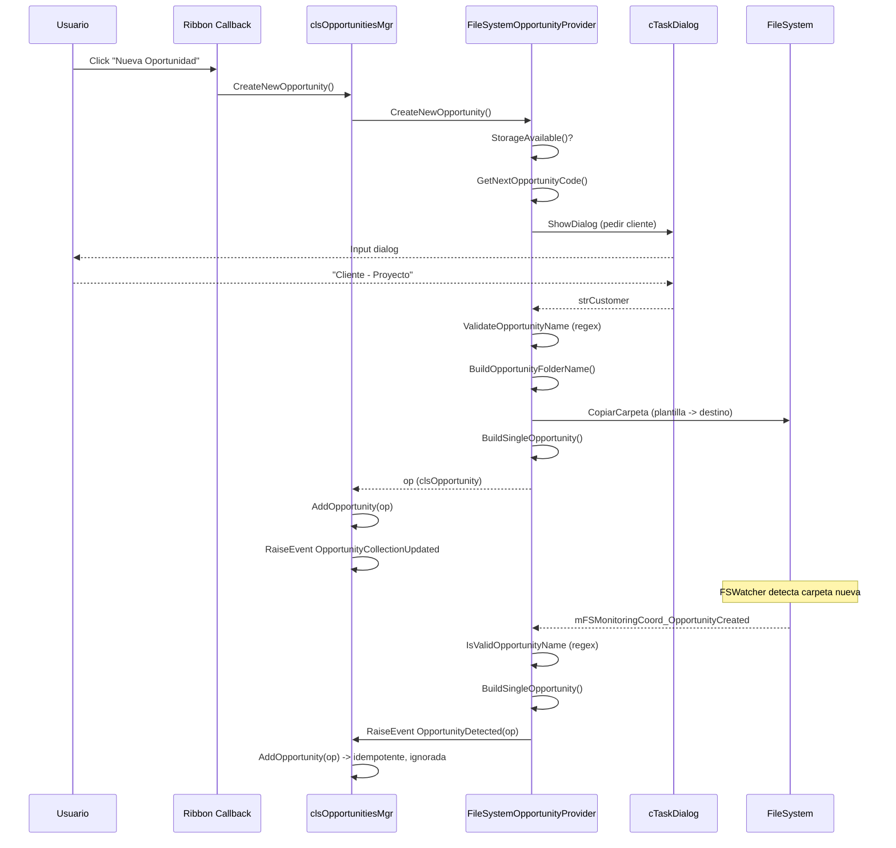
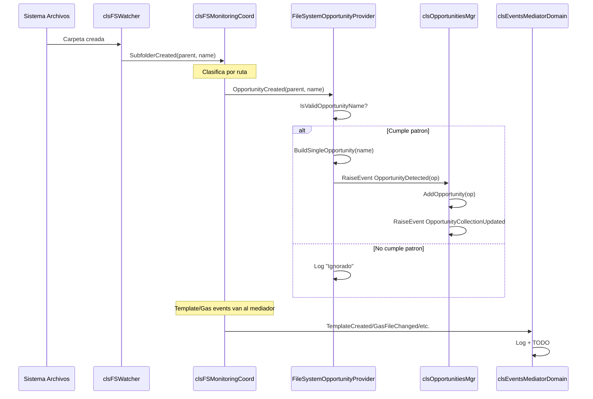

# Refactoring: ProcesarCambiosEnOportunidades → Delegacion al Provider

> Rama: `claude/fix-procesarcambiosenopor-OhvY8`
> Fecha: 2026-02-16
> Relacionado con: sesiones env_VBA / "Review main branch with minimal class instances"

---

## Problema Identificado

`clsOpportunitiesMgr` (capa de dominio) contenia el metodo
`ProcesarCambiosEnOportunidades(subfolderName As String)` que:

1. Recibia un string crudo del sistema de archivos (`subfolderName`)
2. Aplicaba un patron regex (`FILEORFOLDERNAME_QUOTE_CUSTOMER_OTHER_MODEL_PATTERN`)
3. Solo si era valido, llamaba `RefreshOpportunities()`

**Violation:** El dominio no debe conocer patrones de nomenclatura del sistema de
archivos. Esa logica pertenece exclusivamente a la capa de infraestructura, concretamente
a `FileSystemOpportunityProvider`, que ya poseia la misma regex para la carga inicial.

Ademas, `clsEventsMediatorDomain` reenviaba strings crudos `(parentFolder, subfolderName)`
directamente al dominio, en lugar de reenviar objetos de dominio ya construidos.

---

## Arquitectura Objetivo

```
clsFSMonitoringCoord                    [INFRA: strings crudos del SO]
    |
    | OpportunityCreated(parentFolder, subfolderName)
    v
FileSystemOpportunityProvider           [INFRA: valida + construye objeto de dominio]
    - WithEvents mFSMonitoringCoord
    - IsValidOpportunityName()  <-- regex AQUI, no en dominio
    - BuildSingleOpportunity()  <-- sella path dentro de clsOpportunity
    |
    | RaiseEvent OpportunityDetected(op As clsOpportunity)
    | RaiseEvent OpportunityRemoved(opportunityCode As String)
    v
clsEventsMediatorDomain                 [APLICACION: enruta objetos de dominio]
    - WithEvents mOpportunityProvider As FileSystemOpportunityProvider
    |
    | mOpportunities.AddOpportunity(op)
    | mOpportunities.RemoveOpportunity(code)
    v
clsOpportunitiesMgr                     [DOMINIO: puro, sin regex ni FS]
    + AddOpportunity(op As clsOpportunity)
    + RemoveOpportunity(opportunityCode As String)
    - ProcesarCambiosEnOportunidades    ELIMINADO
    - ProcesarCambiosEnItemsOportunidad ELIMINADO (stub vacio)
```

**Limitacion VBA:** `WithEvents` no funciona con interfaces, solo con clases concretas.
Por tanto, `clsEventsMediatorDomain` declara `WithEvents mOpportunityProvider As
FileSystemOpportunityProvider` (tipo concreto). Esto es aceptable: el mediador tiene
como responsabilidad explicita puente entre infraestructura y dominio.

---

## Archivos Modificados

| Archivo | Tipo de cambio |
|---------|---------------|
| `FileSystemOpportunityProvider.cls` | Añade WithEvents, 2 eventos publicos, 5 metodos privados, actualiza Initialize |
| `clsOpportunitiesMgr.cls` | Elimina 2 metodos, añade AddOpportunity y RemoveOpportunity |
| `clsEventsMediatorDomain.cls` | Añade WithEvents field, actualiza Initialize/Terminate, sustituye 5 handlers |
| `clsApplication.cls` | Actualiza 2 llamadas a Initialize (lineas 139 y 154-158) |

---

## Detalle de Cambios

### 1. FileSystemOpportunityProvider.cls

**Nuevo campo WithEvents** (tras `Private mIsReady As Boolean`):
```vba
Private WithEvents mFSMonitoringCoord As clsFSMonitoringCoord
```

**Nuevos eventos publicos:**
```vba
Public Event OpportunityDetected(ByVal op As clsOpportunity)
Public Event OpportunityRemoved(ByVal opportunityCode As String)
```

**Initialize** — nueva firma con parametro opcional:
```vba
Public Sub Initialize(fm As clsFileManager, _
                      oConfiguration As clsConfiguration, _
                      Optional oFSMonitoringCoord As clsFSMonitoringCoord = Nothing)
```
El parametro es Optional para no romper modulos de test existentes
(ej. `modTestOpportunityProvider`) que llaman con 2 argumentos.

**5 nuevos metodos privados:**
- `mFSMonitoringCoord_OpportunityCreated` — valida con regex, construye op, emite `OpportunityDetected`
- `mFSMonitoringCoord_OpportunityDeleted` — extrae codigo, emite `OpportunityRemoved`
- `mFSMonitoringCoord_OpportunityRenamed` — emite Remove(old) + si valido, Detected(new)
- `BuildSingleOpportunity(folderName)` — construye `clsOpportunity` con path sellado
- `ExtractOpportunityCode(folderName)` — extrae los 9 primeros digitos; fallback: nombre completo

---

### 2. clsOpportunitiesMgr.cls

**ELIMINADOS:**
- `ProcesarCambiosEnOportunidades(subfolderName As String)` — viola SRP del dominio
- `ProcesarCambiosEnItemsOportunidad(cambios As String)` — stub vacio, sin callers validos

**AÑADIDOS:**

`AddOpportunity(op As clsOpportunity)`:
- Idempotencia por `op.Number`: si ya existe, log y exit silencioso
- Insercion ordenada (coleccion descendente por Number)
- `RaiseEvent OpportunityCollectionUpdated("added:" & op.Label)`

`RemoveOpportunity(opportunityCode As String)`:
- Busca por `CStr(op.Number) = opportunityCode`
- Si era la oportunidad actual, limpia `mOpportunityState`
- `RaiseEvent OpportunityCollectionUpdated("removed:" & removedLabel)`

---

### 3. clsEventsMediatorDomain.cls

**Añadido campo:**
```vba
Private WithEvents mOpportunityProvider As FileSystemOpportunityProvider
```

**Firma Initialize** — nuevo parametro:
```vba
Public Sub Initialize(..., oOpportunityProvider As FileSystemOpportunityProvider)
```

**ELIMINADOS** (llamaban a metodos ya borrados del dominio):
- `mFSMonitoringCoord_OpportunityCreated`
- `mFSMonitoringCoord_OpportunityDeleted`
- `mFSMonitoringCoord_OpportunityRenamed`
- `mFSMonitoringCoord_OpportunityItemDeleted`
- `mFSMonitoringCoord_OpportunityItemRenamed`

**AÑADIDOS** (reciben objetos de dominio ya construidos):
```vba
Private Sub mOpportunityProvider_OpportunityDetected(ByVal op As clsOpportunity)
    If Not mOpportunities Is Nothing Then mOpportunities.AddOpportunity op
End Sub

Private Sub mOpportunityProvider_OpportunityRemoved(ByVal opportunityCode As String)
    If Not mOpportunities Is Nothing Then mOpportunities.RemoveOpportunity opportunityCode
End Sub
```

La suscripcion `mFSMonitoringCoord` se MANTIENE para eventos no relacionados con
oportunidades: `TemplateCreated/Changed`, `GasFileCreated/Changed`, `MonitoringError/
Reconnected/Failed`, `PausarMonitoreo`/`ReanudarMonitoreo` (contexto invalidado/reiniciado).

---

### 4. clsApplication.cls

```vba
' ANTES (linea 139):
mOpportunityProvider.Initialize mFileMgr, mConfiguration

' DESPUES:
mOpportunityProvider.Initialize mFileMgr, mConfiguration, mFSMonitoringCoord
```

```vba
' ANTES (lineas 154-158):
Call mEvMediatorDomain.Initialize(mCtxMgr.State, mEvMediatorInfrastructure, _
                                  mFSMonitoringCoord, mOpportunities, mFileMgr)
' DESPUES:
Call mEvMediatorDomain.Initialize(mCtxMgr.State, mEvMediatorInfrastructure, _
                                  mFSMonitoringCoord, mOpportunities, mFileMgr, _
                                  mOpportunityProvider)
```

---

## Casos de Borde Considerados

| Escenario | Tratamiento |
|-----------|-------------|
| FSWatcher dispara tras `CreateNewOpportunity` (que ya llamo `RefreshOpportunities`) | `AddOpportunity` es idempotente por `Number`; duplicado silenciado |
| Carpeta eliminada cuyo nombre no empieza por 9 digitos | `ExtractOpportunityCode` devuelve nombre completo; `RemoveOpportunity` no encontrara coincidencia y loguea warning |
| Renombrado: nuevo nombre no cumple patron | `OpportunityRemoved` se emite; `OpportunityDetected` NO — correcto |
| Dos suscriptores a `mFSMonitoringCoord` (provider + mediador) | Intencional: provider gestiona eventos de carpeta de oportunidades; mediador gestiona template/gas/monitoring |
| Modulos de test con `provider.Initialize mFileMgr, mConfiguration` (2 args) | Tercer parametro es `Optional` — sin cambios en tests |

---

## Verificacion

### Compilacion
- Debug > Compile VBA Project → cero errores
- Buscar en todo el proyecto `ProcesarCambiosEnOportunidades` → cero resultados
- Buscar en todo el proyecto `ProcesarCambiosEnItemsOportunidad` → cero resultados

### Tests funcionales (manuales)
1. Carga del XLAM → log muestra `[Initialize] FSMonitoringCoord inyectado`
2. Crear carpeta con nombre valido → log `OpportunityDetected` → `AddOpportunity Anadida` → dropdown del Ribbon actualizado
3. Crear carpeta con nombre invalido (ej. `TEMP_FOLDER`) → log `Ignorado (no cumple patron)` → sin cambio en coleccion
4. Eliminar carpeta valida → log `OpportunityRemoved` → `RemoveOpportunity Eliminada`
5. Usar boton "Nueva Oportunidad" del Ribbon → tras creacion, FSWatcher lanza `AddOpportunity` → log `Ya existe Number=...` (idempotencia confirmada)
6. Renombrar carpeta → log `OpportunityRemoved(oldCode)` + `OpportunityDetected(newOp)`

---

## Issues Conocidos (fuera del scope de este refactor)

Identificados durante el analisis, pendientes de sesiones futuras:

1. **FIXME en clsEventsMediatorInfrastructure** (linea 194): el evento `ActiveFileChanged`
   se captura DOS VECES (aqui y en `clsRibbon`) — problema de rendimiento.

2. **TODO en clsEventsMediatorDomain** (linea 50): funciones de negocio en modulos de macro
   deberian moverse a servicios de dominio.

3. **TODO en clsEventsMediatorDomain** (lineas 108-128): logica de "mover archivo a carpeta
   de oportunidad" comentada — pendiente de decision sobre `FileLocationService`.

4. **Patron a extender**: `FileSystemTechnicalCalcProvider` y otros providers deben aplicar
   el mismo patron (asumir responsabilidades de eventos FS) cuando se necesite reaccion
   a cambios en sus carpetas.

---
---

# Round 2: Limpieza de dominio y reorganizacion de capas

> Rama: `claude/access-previous-session-xIIAn`
> Fecha: 2026-02-16
> Continua el trabajo del Round 1

---

## Problemas Adicionales Identificados

Tras el Round 1, quedaban estas inconsistencias:

1. **`clsOpportunitiesMgr.CreateNewOpportunity`** todavia contenia logica de UI
   (`ShowTaskDialogError`, `cTaskDialog`) y logica de infraestructura (construir
   nombre de carpeta `code & " - " & customer & " - XXX"`).

2. **`clsOpportunitiesMgr.GetCustomerNameFromUser`** usaba regex directamente
   (`FILEORFOLDERNAME_QUOTE_CUSTOMER_OTHER_MODEL_PATTERN`) y cTaskDialog.

3. **`clsEventsMediatorDomain`** actuaba como intermediario innecesario para eventos
   de oportunidades: recibia `OpportunityDetected/Removed` del provider y los
   reenviaba a `clsOpportunitiesMgr`. Paso extra sin valor.

4. **`clsApplication.InitializeDomain`** instanciaba providers (infraestructura)
   junto con managers de dominio. Los providers son infraestructura pura.

5. **`FileSystemEconomicQuoteProvider`** existia pero no era instanciado.

---

## Arquitectura Resultante

```
clsFSMonitoringCoord                    [INFRA: strings crudos del SO]
    |
    | OpportunityCreated(parentFolder, subfolderName)
    v
FileSystemOpportunityProvider           [INFRA: valida + construye + flujo completo de creacion]
    - WithEvents mFSMonitoringCoord
    - IsValidOpportunityName()          <-- regex AQUI
    - BuildSingleOpportunity()          <-- sella path dentro de clsOpportunity
    - CreateNewOpportunity()            <-- flujo interactivo completo (codigo, UI, validacion, FS)
    - GetCustomerNameFromUser()         <-- private, usa cTaskDialog directamente
    - ValidateOpportunityName()         <-- public, para validacion externa
    |
    | RaiseEvent OpportunityDetected(op As clsOpportunity)
    | RaiseEvent OpportunityRemoved(opportunityCode As String)
    v
clsOpportunitiesMgr                     [DOMINIO: puro, sin regex, sin FS, sin UI]
    - WithEvents mConcreteProvider As FileSystemOpportunityProvider
    + AddOpportunity(op)                <-- idempotente por Number
    + RemoveOpportunity(code)
    + CreateNewOpportunity()            <-- delega 100% al provider
    - mConcreteProvider_OpportunityDetected   <-- NUEVO: handler directo
    - mConcreteProvider_OpportunityRemoved    <-- NUEVO: handler directo

clsEventsMediatorDomain                 [APLICACION: solo template/gas/monitoring/context]
    - SIN WithEvents mOpportunityProvider   <-- ELIMINADO
    - SIN mFileMgr                          <-- ELIMINADO
    - Mantiene: mInfraMediador, mFSMonitoringCoord, mOpportunities
```

**Cambio clave:** Los eventos de oportunidades fluyen directamente del provider al
manager de dominio, sin pasar por el mediador. El mediador se queda solo con los
eventos no relacionados con oportunidades.

---

## Diagrama de Flujo: Creacion de Oportunidad (Nueva Oportunidad)



---

## Diagrama de Flujo: Deteccion Automatica (FSWatcher)



---

## Diagrama de Capas: clsApplication (Composition Root)

```
clsApplication.Class_Initialize
    |
    |-- InitializeInfrastructure
    |       |-- clsExecutionContextMgr
    |       |-- clsFileManager
    |       |-- clsEventsMediatorInfrastructure (adapter)
    |       |-- clsConfiguration
    |       |-- clsFSMonitoringCoord
    |       |-- FileSystemOpportunityProvider    <-- MOVIDO aqui
    |       |-- FileSystemTechnicalCalcProvider  <-- MOVIDO aqui
    |       '-- FileSystemEconomicQuoteProvider  <-- NUEVO
    |
    |-- InitializeDomain
    |       |-- clsOpportunitiesMgr
    |       |       '-- Initialize(provider, concreteProvider)
    |       '-- clsEventsMediatorDomain
    |               '-- Initialize(ctxState, infraMediador, fsCoord, opportunities)
    |                   // SIN mFileMgr, SIN mOpportunityProvider
    |
    '-- InitializeUI
            |-- clsEventDispatcher
            '-- clsRibbon
```

---

## Archivos Modificados (Round 2)

| Archivo | Cambios |
|---------|---------|
| `IOpportunityProvider.cls` | Nuevos: `CreateNewOpportunity`, `ValidateOpportunityName`. `CreateOpportunity` devuelve `clsOpportunity` |
| `FileSystemOpportunityProvider.cls` | Absorbe `GetCustomerNameFromUser`, `CreateNewOpportunity` completo, `ValidateOpportunityName`, `BuildOpportunityFolderName` |
| `clsOpportunitiesMgr.cls` | Simplifica `CreateNewOpportunity` (delega a provider). Elimina `GetCustomerNameFromUser`. Agrega `WithEvents mConcreteProvider` + handlers |
| `clsEventsMediatorDomain.cls` | Elimina `WithEvents mOpportunityProvider`, `mFileMgr`, handlers de provider. Initialize de 6 a 4 parametros |
| `clsApplication.cls` | Providers/Config/Monitoring a `InitializeInfrastructure`. Nuevo `mQuoteProvider`. DisposeDomain simplificado |
| `mTDHelper.bas` | Nuevo `ShowTaskDialogInputBox` generico |

---

## Verificacion (Round 2)

### Consistencia de firmas
- `clsOpportunitiesMgr.Initialize(provider, concreteProvider)` — llamado en `clsApplication` con `(mOpportunityProvider, mOpportunityProvider)`
- `clsEventsMediatorDomain.Initialize(ctxState, infraMediador, fsCoord, opportunities)` — 4 params, sin mFileMgr ni mOpportunityProvider
- `IOpportunityProvider.CreateOpportunity` devuelve `clsOpportunity` (no `Boolean`)
- `IOpportunityProvider.CreateNewOpportunity` devuelve `clsOpportunity`

### Tests funcionales (manuales)
1. Carga del XLAM — todos los providers se instancian en `InitializeInfrastructure`
2. Boton "Nueva Oportunidad" — provider gestiona todo el flujo (codigo, dialog, validacion, FS, entidad)
3. Dominio recibe entidad limpia via `AddOpportunity`
4. FSWatcher dispara duplicado → idempotencia via `Number`
5. Mediador NO recibe eventos de oportunidades (solo template/gas/monitoring)

---

## Issues Conocidos (actualizados)

1. **FIXME en clsEventsMediatorInfrastructure**: `ActiveFileChanged` capturado 2 veces.
2. **TODO en clsEventsMediatorDomain**: logica de "mover archivo a oportunidad" comentada.
3. **mOpportunities_CurrentOpportunityChanged**: codigo comentado referencia `mFileMgr` que ya no existe en el mediador. El TODO sigue vigente: la logica debe migrar a un servicio de infraestructura futuro.
4. **ActiveFileSessionChanged, ContextInvalidated/Reinitialized**: eventos del mediador de infraestructura que se mantienen en el mediador de dominio. Pendiente analisis de si deben desaparecer.
